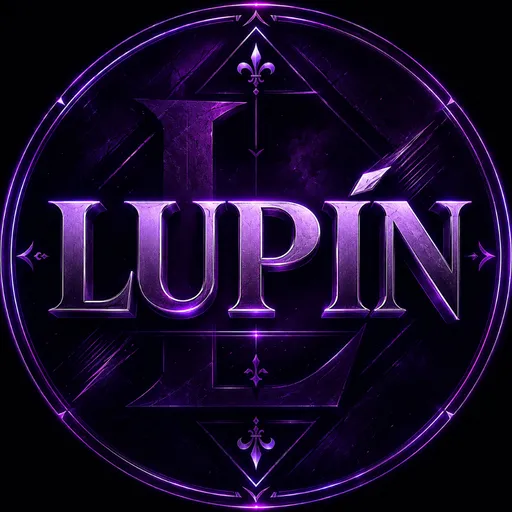

# 💜 Lupin Music

<div align="center">
  
  <br />
  <h3>Next-Generation Luxury Desktop Music Streaming Platform</h3>
  <p>Obsidian Dark & Neon Magenta/Purple Aesthetic • YouTube Music Engine • Discord Rich Presence • Cross-IDE Shared Memory</p>

  [](https://github.com/mrcbrbn5361/LupinMusic/releases)
  [](https://github.com/mrcbrbn5361/LupinMusic/releases)
  [](https://discord.gg/Rma8w8JrQH)
  [](#license)
</div>

---

## ✨ Features

- 🌌 **Luxury Cyber Aesthetic**: Pure Obsidian `#090214`, Electric Magenta `#ec4899`, and Neon Purple `#a855f7` glassmorphism UI.
- ⚡ **Instant High-Fidelity Audio**: Powered by custom background YouTube Music stream engine with 100ms instant track transitions (`loadVideoById`).
- 🛡️ **Built-in Ad & Promo Blocker**: Silent network request interceptor blocks mid-roll, audio, and banner ads cleanly.
- 🎧 **Discord Rich Presence (No Bot Required for Profile)**:
  - Shows *"Listening to Lupin Music"* natively in your personal Discord profile.
  - Live animated scrubber bar (`0:45 / 3:20`), track title, artist, high-res artwork, and Discord guild invite button.
  - Smart rate-limit protection and real-time state diffing.
- 🤖 **Discord Bot Integration (`lupin.music` / `.lupin`)**:
  - Discord bot script (`scripts/discord-bot`) creates cyber neon player cards on demand in your server.
  - Connects locally to desktop app via Port 9863 REST API.
- 🧠 **SyncytiumMD Cross-IDE Memory**:
  - Unified single source of truth for **Antigravity** and **OpenCode** developers.
  - Automatic synchronization across rules, handoffs, and architectural guides.
- 📦 **Dual Platform Support**:
  - **Windows 11 / 10**: Official NSIS Setup with custom Lupin sidebar branding + Portable single-executable.
  - **macOS**: Apple Silicon (`arm64`) & Intel (`x64`) bundles.

---

## 📥 Downloads & Installation

Visit the [Releases](https://github.com/mrcbrbn5361/LupinMusic/releases) page to download the latest version:

| Package | Platform | Description |
|---|---|---|
| **Lupin-Music-Setup-1.0.0-win11.exe** | Windows (x64) | Full installer with desktop & start menu shortcuts and custom Lupin setup wizard |
| **Lupin-Music-Portable-1.0.0-win11.exe** | Windows (x64) | Standalone portable executable. No installation required! |
| **Lupin Music (macOS)** | macOS (arm64 / x64) | Pre-built macOS bundles |

---

## 🚀 Development Setup

### Requirements
- [Node.js](https://nodejs.org/) (v18 or higher)
- npm or pnpm

### Clone & Install
```bash
git clone https://github.com/mrcbrbn5361/LupinMusic.git
cd LupinMusic
npm install
```

### Run Locally
```bash
# Start Desktop Application in development mode
npm run dev

# Run Discord Bot
npm run bot
```

### Build Packages
```bash
# Build desktop main & renderer
npm run build

# Build Windows Installer (NSIS) and Portable .exe
npm run build:win

# Build macOS packages
npm run build:mac
```

---

## 💜 Community & Discord

Join our official Discord community:  
👉 **[https://discord.gg/Rma8w8JrQH](https://discord.gg/Rma8w8JrQH)**

---

## 📄 License

Distributed under the MIT License. See `LICENSE` for more information.
